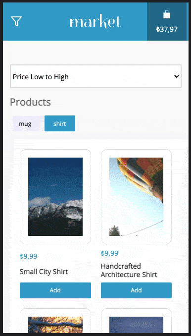
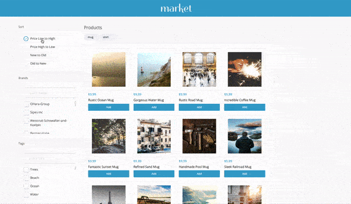

# Frontend Coding Challenge

This project was created for demonstrating frontend development skills. 


## Live demo: [https://hardcore-wescoff-c6abd6.netlify.app/](https://hardcore-wescoff-c6abd6.netlify.app/)

\
&nbsp;

Live fake api: [https://mock-product-service.herokuapp.com/](https://mock-product-service.herokuapp.com/) \
Repo: https://github.com/mehmetyilmaz001/getir-frontend-react-challenge


\
&nbsp;
\
&nbsp;


## Previews




\
&nbsp;
\
&nbsp;
## Available Scripts

In the project directory, you can run for the local development enviroment which is configured on json-server:

### `yarn start`

Starts the fake REST API server on [http://localhost:4000](http://localhost:4000) and runs the app in development mode on [http://localhost:3000](http://localhost:3000).


### `yarn start:web`

```sh
yarn start:web
```

Runs the app in development mode on [http://localhost:3000](http://localhost:3000).

### `yarn start:api`

```sh
yarn start:web
```

Starts the fake REST API server on [http://localhost:4000](http://localhost:4000).


\
&nbsp;
\
&nbsp;

## Fake REST API

Running on [http://localhost:4000](http://localhost:4000).


\
&nbsp;
\
&nbsp;

## The tools that used

- Typescript
- Redux Toolkit
- Styled Components
- Jest
- json-server
- create-react-app

\
&nbsp;
\
&nbsp;
  
### Note
All simple ui components (excep pagination) were created by me.
  
